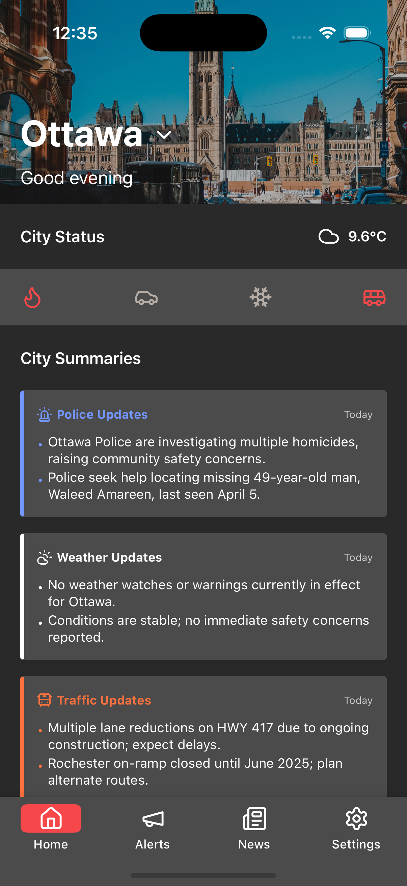
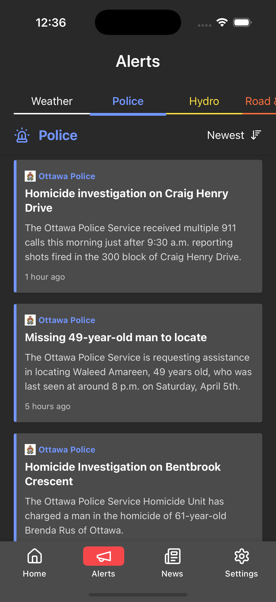
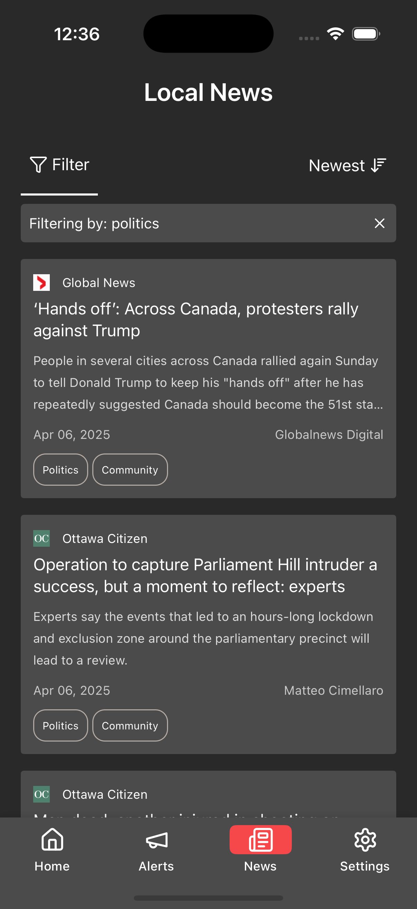

<p align="center">
  
</p>

<h2 align="center">Scopes</h2>

<p align="center">
  Hyperlocal city status, alerts, traffic and news — built with React Native + Expo.
</p>

<p align="center">
  
  
  
  
</p>

---

## Screenshots

<p align="center">
  
  
  
</p>

## What is Scopes?

Scopes is a polished iOS app that brings together the essential daily signals for your city:

- City service status, weather, and traffic at a glance
- Real‑time alerts for weather, police updates, and road events
- Curated local news with sorting and tag filters
- A clean, animation‑driven UI with dark mode and localization


## Features

- City Dashboard
  - Animated header with city selector and time‑of‑day greeting
  - Live city service status via a lightweight backend
  - Compact summaries for police, weather, and traffic
- Alerts
  - Category tabs: Weather, Police, Hydro (sample), Road & Traffic
  - Pull‑to‑refresh with a custom indicator and sticky sort controls
- Local News
  - Aggregated feed with newest/oldest sorting
  - Optional tag filter and compact card layout
- UX & Performance
  - Smooth Reanimated transitions, FlashList for large lists
  - Persistent caching with MMKV
- Platform
  - iOS (Expo Dev Client), dark/light themes, multi‑language i18n (English, French, Spanish, Arabic, Hindi, Japanese, Korean)

## Tech Stack

- React Native 0.76, Expo 52, TypeScript
- Navigation: React Navigation
- State: MobX‑State‑Tree (+ mobx‑react‑lite)
- Networking: apisauce
- Storage: react‑native‑mmkv
- Animations: react‑native‑reanimated
- Lists: @shopify/flash-list
- i18n: i18next + expo‑localization

## Architecture

```
app/
  components/       // Reusable UI (cards, headers, lists)
  screens/          // Home, Alerts, News, Settings stacks
  navigators/       // Bottom tabs and stacks
  models/           // MobX-State-Tree stores
  services/api/     // API client + domain APIs (news, alerts, status)
  theme/            // Colors, spacing, typography, theming hooks
  i18n/             // Localized strings and i18n setup
  utils/            // Helpers (formatting, storage, hooks)
```

Key implementation notes:

- API client is configured in `app/services/api/api.ts` and sourced from `app/config/`.
- Screens stitch together stores, hooks, and themed components.
- The home dashboard uses a combination of Reanimated shared values and interpolations for subtle motion.

## Data Sources

The app talks to a small backend (Vercel) that aggregates public sources.

- News: `GET /api/getNews`
- Weather alerts: `GET /api/getWeatherAlerts`
- Traffic alerts: `GET /api/getTrafficAlerts`
- City status (Ottawa): `GET https://local-government-app-backend.vercel.app/api/getOttawaStatus`

API base URL is configurable in `app/config/config.dev.ts` (`API_URL`).

## Getting Started (iOS)

Prerequisites: Node 18+ (or 20+), Yarn, Xcode (latest), CocoaPods.

```bash
# 1) Install dependencies
yarn install

# 2) Start the Expo server
yarn start

# 3a) Run on iOS simulator using the Expo Dev Client
yarn ios

# 3b) Or build a local Dev Client with EAS (recommended once per machine)
yarn build:ios:sim   # simulator build
# or
yarn build:ios:dev   # device build

# 4) Production build (local EAS)
yarn build:ios:prod
```

If you change native modules or `app.json` app config, run a clean prebuild:

```bash
yarn prebuild:clean
```

## Useful Scripts

```bash
yarn lint           # lint and auto-fix
yarn test           # run unit tests (Jest)
yarn web            # run web preview (Expo for Web)
```

## Contributing

Issues and pull requests are welcome. If you’d like to propose a change:

1. Fork the repo and create a feature branch.
2. Keep edits focused and well‑scoped; include screenshots for UI changes.
3. Run lint and tests before opening a PR.

## Acknowledgements

Built with the excellent Ignite boilerplate and the Expo ecosystem.
